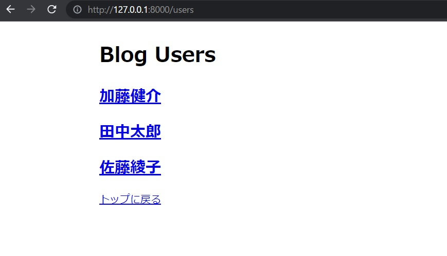
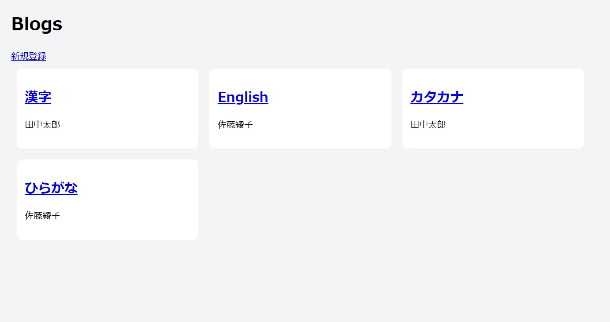
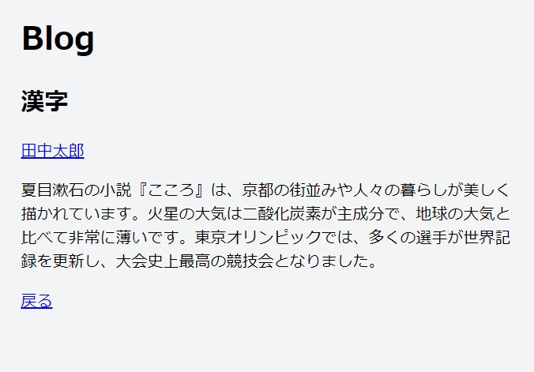

<h1>Django練習課題</h1>

本課題では、ブログアプリを想定して開発して頂きます。ブログアプリは複数のユーザーによって管理されることを想定しています。ブログ記事を投稿する際には、著者情報をユーザーから選択できるようにしていきます。またユーザー詳細画面では、ユーザーが書いた記事が一覧で表示できるようにします。
  
<b>*本課題は先に<a href="https://tutorial.djangogirls.org/ja/">DjangoGirls</a>というサイトでDjangoの基礎を学習していることを前提にしています。</b>
 
 
それでは以下の流れで課題を進めてみて下さい。 
なおソースコードはアップロードしている通りなので、わからない場所があったら適宜確認しながら進めてみて下さいね。 
また<a href="https://github.com/1110-t/DjangoExersise/blob/master/Django.pdf"><b>Django.pdf</b></a>にてDjangoでアプリケーションを作る流れについて概説しております。難しく感じられる方は最初にこちらの資料に目を通して頂いた方がいいかもしれません。

<h2>Djangoプロジェクトの作成</h2>
以下の内容でプロジェクトを作成してください。 

<dl>
    <dt>プロジェクト名：</dt><dd><b>katachi</b></dd>
    <dt>アプリケーション名：</dt><dd><b>blog</b></dd>
    <dt>仮想環境名：</dt><dd><b>venv</b></dd>
    <dt>必要なパッケージ：</dt><dd><b>Django 3.2.10</b></dd>
    <dt>使用するデータベース：</dt><dd><b>MySQL</b></dd>
</dl>

またこのプロジェクトを実行し、URL「<a>http://127.0.0.1:8000/</a>」でindex.htmlを表示してください。以下のような画面が表示されたら問題ありません。

<h2>ユーザー(User)モデルを作ってみましょう</h2>
まずはそれぞれのユーザーを登録できるように、以下のようなパラメータを持つモデルを作ってみましょう。
<table>
    <thead>
        <tr>
            <td></td>
            <td>パラメータ名</td>
            <td>型</td>
            <td>制約</td>
        </tr>
    </thead>
    <tbody>
        <tr>
            <td>名前</td>
            <td>name</td>
            <td>文字列</td>
            <td>最大20文字・入力必須</td>
        </tr>
        <tr>
            <td>誕生日</td>
            <td>birthday</td>
            <td>日付</td>
            <td>入力必須</td>
        </tr>
        <tr>
            <td>性別</td>
            <td>gender</td>
            <td>選択</td>
            <td>入力必須</td>
        </tr>
        <tr>
            <td>血液型</td>
            <td>bloodtype</td>
            <td>選択</td>
            <td>入力必須</td>
        </tr>
        <tr>
            <td>プロフィール</td>
            <td>profile</td>
            <td>文字列</td>
            <td>入力必須</td>
        </tr>
    </tbody>
</table>

<h2>管理画面からデータを追加してみましょう</h2>
まずは、管理画面を扱えるように管理者ユーザーをコマンドから作成してください。IDとパスワードは任意に設定頂いて構いません。 
管理者画面からユーザーモデルを参照して、扱えるように設定し、以下のようにデータを登録してください。
<table>
    <thead>
        <tr>
            <td>ID</td>
            <td>name</td>
            <td>birthday</td>
            <td>gender</td>
            <td>bloodtype</td>
            <td>profile</td>
        </tr>
    </thead>
    <tbody>
        <tr>
            <td>1</td>
            <td>加藤健介</td>
            <td>1990/11/10</td>
            <td>0</td>
            <td>o</td>
            <td>趣味は旅行で、今はアラスカで一人旅をしています。</td>
        </tr>
        <tr>
            <td>2</td>
            <td>田中太郎</td>
            <td>2000/10/12</td>
            <td>0</td>
            <td>b</td>
            <td>船乗りです。今はどこかの半島の沖にいます。帰りたいです。</td>
        </tr>
        <tr>
            <td>3</td>
            <td>佐藤綾子</td>
            <td>1995/4/14</td>
            <td>1</td>
            <td>a</td>
            <td>凧あげが好きです。</td>
        </tr>
    </tbody>
</table>

一覧で表示したとき、下のような画面が表示されたら問題ありません。

<h2>ユーザーの情報を一覧で表示してみましょう</h2>
URLで「<a>http://127.0.0.1:8000/users</a>」にアクセスしたら、登録しているユーザーの情報がコンソールに表示されるようにして下さい。

<h2>ブラウザにユーザー情報が一覧で表示されるようにしましょう</h2>
URLで「<a>http://127.0.0.1:8000/users</a>」にアクセスしたら、登録しているユーザーの情報がブラウザに表示されるようにして下さい。 また名前をクリックすると、ユーザーの詳細が表示されるようにしてみて下さい。表示するデータは、名前・生年月日・性別・血液型・プロフィール文です。 
<ul>
<li>性別は1の時は「男性」、0の時は「女性」と表示されるようにしましょう。</li>
<li>また血液型についてはA型,B型,AB型,O型のように表示されるようにしてください。</li>
</ul>
下のような画面で表示できていれば問題ありません。 
<figure>
    
    <figcaption>一覧画面</figcatption>
</figure>
<figure>
    
    <figcaption>詳細画面</figcatption>
</figure>

<h2>記事(Article)モデルを作ってみましょう</h2>
まずはそれぞれの記事を登録できるように、以下のようなパラメータを持つモデルを作ってみましょう。

<table>
    <thead>
        <tr>
            <th></th>
            <td>パラメータ名</td>
            <td>型</td>
            <td>制約</td>
        </tr>
    </thead>
    <tbody>
        <tr>
            <td>タイトル</td>
            <td>title</td>
            <td>文字列</td>
            <td>最大200文字・入力必須</td>
        </tr>
        <tr>
            <td>著者ID</td>
            <td>author_id</td>
            <td>数値</td>
            <td>外部キーとしてUserモデルを指定、Userモデルと削除連携、入力必須</td>
        </tr>
        <tr>
            <td>プロフィール</td>
            <td>text</td>
            <td>文字列</td>
            <td>入力必須</td>
        </tr>
    </tbody>
</table>

<h2>管理画面からデータを追加してみましょう</h2>
管理者画面から記事モデルを参照して、いくつかデータを登録してみて下さい。ここでは自由にデータを登録して頂いて大丈夫です。複数の記事を登録しておくと、アプリらしく見えます。

<h2>ブラウザにブログ記事が一覧で表示されるようにしましょう</h2>
URLで「<a>http://127.0.0.1:8000/</a>」にアクセスしたら、登録しているブログ記事がブラウザに一覧で表示されるようにして下さい。表示する項目はブログのタイトルと、著者のユーザー名のみを表示するようにしてください。 
ブログのタイトルをクリックすると、ブログ記事の内容も表示されるようにしてみましょう。また詳細画面を表示した時、著者名をクリックすると、先ほど作ったユーザーの詳細画面を表示するようにしましょう。
下のような画面で表示できていれば問題ありません。 
<figure>
    
    <figcaption>一覧画面</figcatption>
</figure>
<figure>
    
    <figcaption>詳細画面</figcatption>
</figure>

<h2>ブログの新規投稿画面を作成してみましょう</h2>
URLで「<a>http://127.0.0.1:8000/</a>」にアクセスした時、新規登録ボタンを用意して下さい。新規登録ボタンを押すと、ブログの新規登録画面が表示されるようにしましょう。この際、<b>Articleモデルを使用したforms.py</b>を介してフォーム全体が表示されるようにしましょう。 
例えば下記のように画面が表示されるようにして下さい。この際、著者のところは、登録されているユーザーから選べるようにしましょう。

<h2>ブログの編集画面を作成してみましょう</h2>
URLで「<a>http://127.0.0.1:8000/</a>」にアクセスした時、登録されているブログが一覧で表示されますね。その下に、編集ボタンを用意しましょう。編集ボタンを押すと、新規登録画面のhtmlを使って、予め登録されているブログ情報を取得して、内容を編集できるようにしましょう。 

<h2>ブログの削除ができるようにしましょう</h2>
URLで「<a>http://127.0.0.1:8000/</a>」にアクセスした時、登録されているブログが一覧で表示されますね。編集ボタンの下に、削除ボタンを用意しましょう。削除ボタンを押すとデータベースからデータを削除できるようにしてみましょう。例えば下記のような画面を表示するようにしてみて下さい。

<h2>最後に、ユーザー詳細画面にユーザー書いたブログ記事の一覧が表示されるようにしましょう</h2>
例えば下記のように表示されていたら、正解です。ここまでお疲れ様でした。
